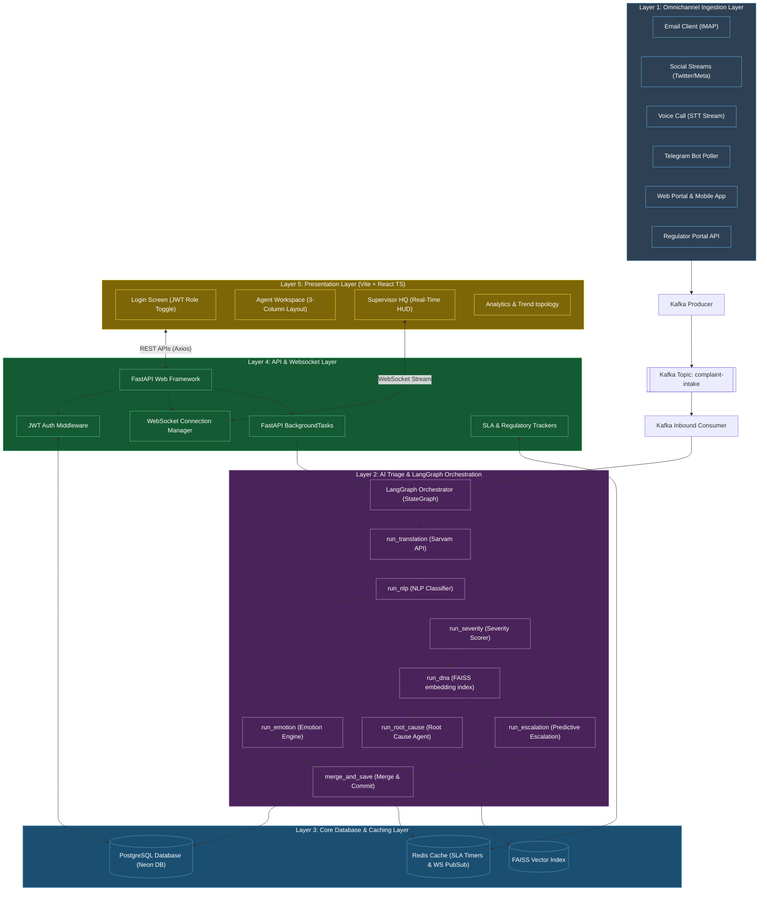

# D3: Technical Architecture Document

## UCCD: Unified Customer Complaint & Case Dashboard
**Author:** Lead Senior Developer  
**Target:** Technical Architects, Engineering Teams, and Security Officers  
**Date:** May 30, 2026

---

## 1. Labeled Architecture Diagram
The diagram below illustrates the end-to-end component layout and data connections across the UCCD stack, from omnichannel ingestion to the live React supervisor/agent frontends.

---

## 2. Layer-by-Layer Architectural Component Details

### Layer 1: Ingestion & Normalization
- **Omnichannel Connectors**: Custom connectors listen to inbound communication APIs (IMAP/SMTP for email, Telegram Bot APIs, Webhooks for Twitter, Instagram, WhatsApp, and structured REST APIs for portals).
- **Universal Schema Validation**: Raw messages are mapped to the Pydantic schema `ComplaintCreate`. Customer references, names, phone numbers, and emails are extracted from free text using Regex and Groq fallbacks before processing.
- **Kafka Event Buffer**: Inbound complaints are buffered in Apache Kafka under the `complaint-intake` topic. This prevents data loss during high-traffic spikes and allows decoupled, asynchronous consumer workers to run at their own pace.

### Layer 2: LangGraph AI Triage Engine
- **LangGraph StateGraph Orchestration**: The AI pipeline is built as a state machine where nodes execute specialized agent logic and update a shared, structured state (`ComplaintState`).
- **Parallel Branching**:
  - `run_translation`: First detects incoming language and translates regional text to English using the Sarvam API wrapper.
  - `run_nlp`: Uses Groq LLaMA-3.1 to classify issue types, intents, products, and regulatory tags.
  - *Parallel Fan-out 1*: `run_nlp` feeds `run_emotion` and `run_severity` in parallel.
  - *Parallel Fan-out 2*: `run_severity` feeds `run_dna` (FAISS similarity grouping) and `run_escalation` (predictive SLA analysis) in parallel.
  - *Fan-in*: The outputs are merged and saved in `merge_and_save`, which commits to the DB, registers Redis SLA timers, and auto-assigns the ticket using specialized routing algorithms.

### Layer 3: Storage & Core Infrastructure
- **Neon PostgreSQL DB**: The primary transactional store containing schemas for `complaints`, `users`, `sla_timers`, and audit logs.
- **Redis Cache & Timer Store**: Stores active SLA metadata hashes (`sla_meta:{complaint_id}`) and coordinates real-time event broadcasting using Redis channels.
- **FAISS (Facebook AI Similarity Search)**: Holds local vector indices of historical complaints to match newly ingested text against existing cases for deduplication.

### Layer 4: API & WebSockets Gateway
- **FastAPI Engine**: The core web app exposes endpoints for complaints CRUD operations, authentication, live dashboard stats, and simulations.
- **JWT Auth Middleware**: Intercepts requests to enforce role-based access control (RBAC) across Agent, Supervisor, and Compliance roles.
- **WebSocket Connection Manager**: Manages open persistent sockets, broadcasting live triage updates and SLA breaches directly to supervisor screens.

### Layer 5: Presentation Dashboard (Vite + React)
- **Vite React App**: Fast, single-page application built with TypeScript, styled with a modern, glassmorphic dark navy and teal design system.
- **Component-Driven Workspaces**:
  - `QueuePage`: Lists open files with active countdown bars.
  - `ComplaintDetail`: A 3-column triage workspace detailing customer history, chat transcripts, dynamic emotion arcs, and auto-generated response drafts.
  - `SupervisorHQ`: HUD mapping live volumes, agent capacities, active escalations, and a live activity feed.

---

## 3. End-to-End Data Lifecycle Flow
The sequence diagram below tracks the life of a complaint submitted by a customer through the Telegram messaging app.

```mermaid
sequenceDiagram
    autonumber
    actor Customer as Telegram Customer
    participant TG_Bot as Telegram Bot Poller
    participant Kafka as Kafka Event Topic
    participant AgentWorker as LangGraph Worker
    participant DB as Postgres Neon DB
    participant Redis as Redis Cache
    participant WS as WebSocket Manager
    actor Supervisor as Supervisor Dashboard

    Customer->>TG_Bot: Sends message "My card is stuck in the ATM!"
    TG_Bot->>TG_Bot: Extract customer metadata & token
    TG_Bot->>Kafka: Publishes Universal Complaint Envelope
    Kafka->>AgentWorker: Consumes queue message
    
    rect rgb(74, 35, 90)
        Note over AgentWorker: LangGraph Agent Swarm Triage
        AgentWorker->>AgentWorker: Translate Hindi/Regional to English (Sarvam)
        AgentWorker->>AgentWorker: Classify category: ATM Cards (Groq LLaMA)
        AgentWorker->>AgentWorker: Extract Sentiment: Frustrated | Intensity: 8
        AgentWorker->>AgentWorker: Compute DNA similarity & lookup duplicates (FAISS)
        AgentWorker->>AgentWorker: Assess Severity: 0.85 (High Risk)
        AgentWorker->>AgentWorker: Predict SLA breach risk: 80% (Escalate!)
        AgentWorker->>AgentWorker: Generate Apologetic AI Response Draft
    end

    AgentWorker->>DB: INSERT/UPDATE complaint record & AI attributes
    AgentWorker->>Redis: Set SLA timers (24h countdown)
    AgentWorker->>WS: Broadcast event: "Complaint #123 created (ATM Cards, Severity: 0.85)"
    WS->>Supervisor: Live WebSocket notification toast & queue card update
    AgentWorker->>TG_Bot: Send confirmation message & SLA ETA
    TG_Bot->>Customer: Reply: "We received your complaint. Ticket ID is #123. Resolving in 24 hours."
```

---

## 4. Architectural Decisions & Rationale

### A. Async LangGraph Workflows with BackgroundTasks
- **The Challenge**: The multi-agent LLM pipeline involves multiple API calls (Groq, Sarvam, FAISS) and database operations. Running this synchronously inside a FastAPI request thread would block request threads and cause timeouts for users.
- **The Decision**: Incoming complaints via endpoints return an immediate acknowledgment (`202 Accepted` with the `complaint_id`). The server passes the orchestrator pipeline to a FastAPI `BackgroundTasks` runner or external workers, executing the LangGraph pipeline asynchronously in the background.

### B. Redis SLA Timers with APScheduler Fallbacks
- **The Challenge**: We need real-time, low-overhead tracking of countdown deadlines for thousands of complaints, triggering alerts at 50%, 75%, 90%, and 100% elapsed time.
- **The Decision**: Redis hashes with Time-to-Live (TTL) tracking are utilized for performance. An APScheduler background task sweeps these keys every 60 seconds. In the event of a Redis restart or connection drop, the system queries the primary Postgres database for deadlines as an active fallback.

### C. FAISS for Semantic Deduplication
- **The Challenge**: Rule-based similarity search (e.g. Levenshtein distance) fails to match different phrasing of the same issue (e.g. *"ATM ate my card"* vs *"Card swallowed by cash machine"*).
- **The Decision**: The system converts every complaint into a dense vector embedding using HuggingFace / OpenAI embeddings and indexes them using local FAISS bins. This enables sub-millisecond semantic duplicate matches without querying heavy external vector DBs during the POC phase.
