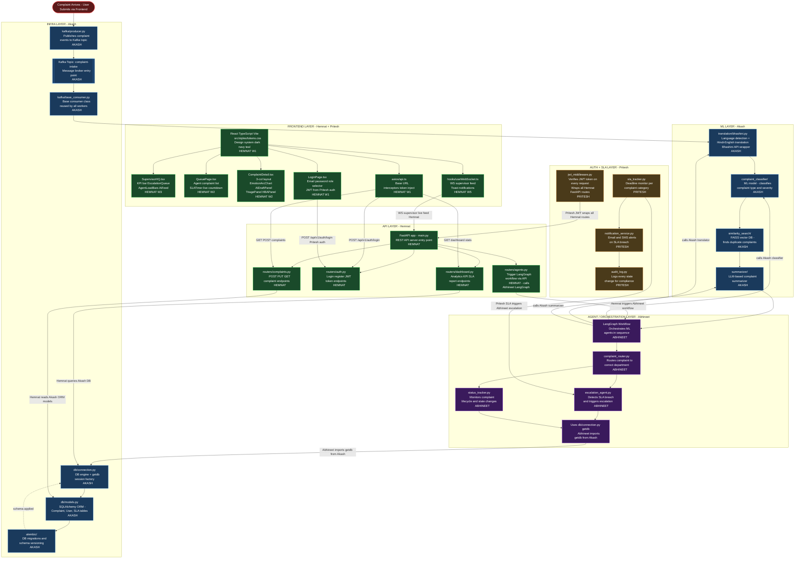

```mermaid
flowchart TD

    COMPLAINT(["Complaint Arrives - User Submits via Frontend"])

    subgraph INFRA ["INFRA LAYER - Akash"]
        direction TB
        KAFKA_PROD["kafka/producer.py
        Publishes complaint events to Kafka topic
        AKASH"]
        KAFKA_BASE["kafka/base_consumer.py
        Base consumer class reused by all workers
        AKASH"]
        TOPIC_IN[["Kafka Topic: complaint-intake
        Message broker entry point
        AKASH"]]
        DB_CONN["db/connection.py
        DB engine + getdb session factory
        AKASH"]
        DB_MODELS["db/models.py
        SQLAlchemy ORM - Complaint, User, SLA tables
        AKASH"]
        ALEMBIC["alembic/
        DB migrations and schema versioning
        AKASH"]
    end

    subgraph ML ["ML LAYER - Akash"]
        direction TB
        TRANSLATE["translation/bhashini.py
        Language detection + Hindi-English translation
        Bhashini API wrapper
        AKASH"]
        CLASSIFY["complaint_classifier/
        ML model - classifies complaint type and severity
        AKASH"]
        SIMILARITY["similarity_search/
        FAISS vector DB - finds duplicate complaints
        AKASH"]
        SUMMARIZE["summarizer/
        LLM-based complaint summarizer
        AKASH"]
    end

    subgraph AGENT ["AGENT / ORCHESTRATION LAYER - Abhineet"]
        direction TB
        LANGGRAPH["LangGraph Workflow
        Orchestrates ML agents in sequence
        ABHINEET"]
        ROUTER["complaint_router.py
        Routes complaint to correct department
        ABHINEET"]
        ESCALATION["escalation_agent.py
        Detects SLA breach and triggers escalation
        ABHINEET"]
        STATUS["status_tracker.py
        Monitors complaint lifecycle and state changes
        ABHINEET"]
        ORM["Uses db/connection.py getdb
        Abhineet imports getdb from Akash"]
    end

    subgraph API ["API LAYER - Hemnat"]
        direction TB
        FASTAPI["FastAPI app - main.py
        REST API server entry point
        HEMNAT"]
        R_COMPLAINTS["routers/complaints.py
        POST PUT GET complaint endpoints
        HEMNAT"]
        R_AUTH["routers/auth.py
        Login register JWT token endpoints
        HEMNAT"]
        R_DASHBOARD["routers/dashboard.py
        Analytics KPI SLA report endpoints
        HEMNAT"]
        R_AGENTS["routers/agents.py
        Trigger LangGraph workflow via API
        HEMNAT - calls Abhineet LangGraph"]
    end

    subgraph AUTHSLA ["AUTH + SLA LAYER - Pritesh"]
        direction TB
        JWT["jwt_middleware.py
        Verifies JWT token on every request
        Wraps all Hemnat FastAPI routes
        PRITESH"]
        SLA["sla_tracker.py
        Deadline monitor per complaint category
        PRITESH"]
        NOTIFY["notification_service.py
        Email and SMS alerts on SLA breach
        PRITESH"]
        AUDIT["audit_log.py
        Logs every state change for compliance
        PRITESH"]
    end

    subgraph FRONTEND ["FRONTEND LAYER - Hemnat + Pritesh"]
        direction TB
        REACT["React TypeScript Vite
        src/styles/tokens.css
        Design system dark navy teal
        HEMNAT W1"]
        SUPERVISOR["SupervisorHQ.tsx
        KPI bar EscalationQueue
        AgentLoadBars AiFeed
        HEMNAT W3"]
        QUEUE["QueuePage.tsx
        Agent complaint list
        SLATimer live countdown
        HEMNAT W2"]
        DETAIL["ComplaintDetail.tsx
        3-col layout EmotionArcChart
        AIDraftPanel TriagePanel HBAPanel
        HEMNAT W2"]
        LOGIN["LoginPage.tsx
        Email password role selector
        JWT from Pritesh auth
        HEMNAT W1"]
        WEBSOCKET["hooks/useWebSocket.ts
        WS supervisor feed
        Toast notifications
        HEMNAT W5"]
        AXIOS["axios/api.ts
        Base URL interceptors token inject
        HEMNAT W1"]
    end

    %% MAIN DATA FLOW
    COMPLAINT --> KAFKA_PROD
    KAFKA_PROD --> TOPIC_IN
    TOPIC_IN --> KAFKA_BASE
    KAFKA_BASE --> TRANSLATE
    TRANSLATE --> CLASSIFY
    CLASSIFY --> SIMILARITY
    SIMILARITY --> SUMMARIZE
    SUMMARIZE --> LANGGRAPH

    %% INFRA CONNECTIONS
    DB_CONN --> DB_MODELS
    DB_MODELS --> ALEMBIC
    ALEMBIC -.->|"schema applied"| DB_CONN

    %% ABHINEET uses AKASH infra
    ORM -->|"Abhineet imports getdb from Akash"| DB_CONN
    LANGGRAPH --> ROUTER
    ROUTER --> ESCALATION
    ROUTER --> STATUS
    ESCALATION --> ORM
    STATUS --> ORM

    %% LANGGRAPH uses AKASH ML modules
    LANGGRAPH -->|"calls Akash classifier"| CLASSIFY
    LANGGRAPH -->|"calls Akash translator"| TRANSLATE
    LANGGRAPH -->|"calls Akash summarizer"| SUMMARIZE

    %% HEMNAT API uses ABHINEET agents
    R_AGENTS -->|"Hemnat triggers Abhineet workflow"| LANGGRAPH
    FASTAPI --> R_COMPLAINTS
    FASTAPI --> R_AUTH
    FASTAPI --> R_DASHBOARD
    FASTAPI --> R_AGENTS

    %% HEMNAT API uses AKASH DB
    R_COMPLAINTS -->|"Hemnat reads Akash ORM models"| DB_MODELS
    R_DASHBOARD -->|"Hemnat queries Akash DB"| DB_CONN

    %% PRITESH wraps HEMNAT
    JWT -->|"Pritesh JWT wraps all Hemnat routes"| FASTAPI
    SLA -->|"Pritesh SLA triggers Abhineet escalation"| ESCALATION
    SLA --> NOTIFY
    NOTIFY --> AUDIT

    %% FRONTEND calls HEMNAT API
    AXIOS -->|"POST /api/v1/auth/login"| R_AUTH
    AXIOS -->|"GET POST complaints"| R_COMPLAINTS
    AXIOS -->|"GET dashboard stats"| R_DASHBOARD
    REACT --> SUPERVISOR
    REACT --> QUEUE
    REACT --> DETAIL
    REACT --> LOGIN
    REACT --> WEBSOCKET
    REACT --> AXIOS

    %% AUTH connects frontend
    LOGIN -->|"POST /api/v1/auth/login Pritesh auth"| R_AUTH
    WEBSOCKET -->|"WS supervisor live feed Hemnat"| FASTAPI

    %% STYLING
    classDef akash fill:#1a3a5c,stroke:#4a9eff,color:#ffffff
    classDef abhineet fill:#3a1a5c,stroke:#a04aff,color:#ffffff
    classDef hemnat fill:#1a4a2a,stroke:#4aff6a,color:#ffffff
    classDef pritesh fill:#4a3a1a,stroke:#ffaa4a,color:#ffffff
    classDef entry fill:#5c1a1a,stroke:#ff4a4a,color:#ffffff

    class KAFKA_PROD,KAFKA_BASE,TOPIC_IN,DB_CONN,DB_MODELS,ALEMBIC,TRANSLATE,CLASSIFY,SIMILARITY,SUMMARIZE akash
    class LANGGRAPH,ROUTER,ESCALATION,STATUS,ORM abhineet
    class FASTAPI,R_COMPLAINTS,R_AUTH,R_DASHBOARD,R_AGENTS,REACT,SUPERVISOR,QUEUE,DETAIL,LOGIN,WEBSOCKET,AXIOS hemnat
    class JWT,SLA,NOTIFY,AUDIT pritesh
    class COMPLAINT entry
```